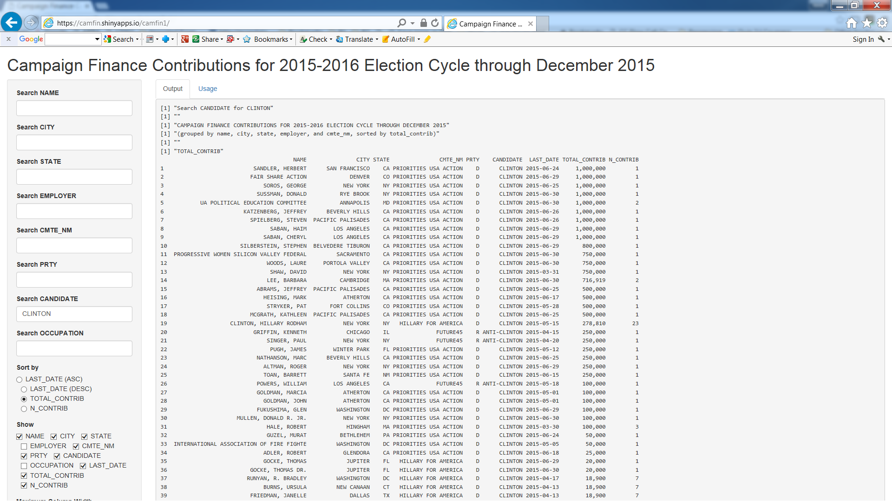

Coursera Developing Data Products Project
========================================================
author: R Davis
date: January 30, 2016
width: 1440
height: 900

Project Details
========================================================

Consists of a Shiny application to filter campaign finance data from the FEC (Federal Election Committee)

Data is from the 2015-2016 election cycle through December 2015

URL of Shiny app: https://camfin.shinyapps.io/camfin/ 

URL of Git-hub:

Variables
========================================================

N   | Variable     | Description
--- | ------------ | ---------------------------------------
1.  | NAME         | Contributor/Lender/Transfer Name
2.  | CITY         | City/Town
3.  | STATE        | State
4.  | EMPLOYER     | Employer
5.  | CMTE_NM      | Committee Name
6.  | PRTY         | Party of D (Democrat) or R (Republican)
7.  | CANDIDATE    | Candidate Last Name
8.  | OCCUPATION   | Occupation
9.  | LAST_DATE    | Last Transaction Date
10. | TOTAL_CONRIB | Total Contributions
11. | N_CONTRIB    | Number of Contributions

All variables are selectable and all but last three are searchable.
Usage instructions can be obtained by clicking on Usage tab.

Brief Look at the Data
========================================================


```r
oo <- read.csv("inemcm16.csv")
dim(oo)
```

```
[1] 604775     12
```

```r
tail(levels(oo$LAST_DATE), n = 10)
```

```
 [1] "2015-12-25" "2015-12-26" "2015-12-27" "2015-12-28" "2015-12-29"
 [6] "2015-12-30" "2015-12-31" "2016-03-31" "2016-07-26" "2025-08-05"
```

As can be seen, there are over a half-million records. Except for 3 apparently misdated records,
they appear to go through December 31, 2015.

Initial Screen with Output and Usage Tabs
========================================================


